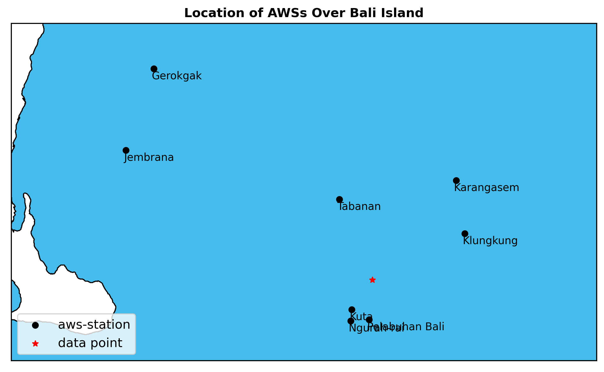

# ATMS 523 Weather and Climate Data Analytics 

## Module 8: Individual Final Project - Machine Learning Application

In this module I applied several technique of machine learning that already given by the professor. They include:
- Application of future engineering: label encoder and one-hot-encoder
- Explainble AI by applying `permutation importance`, `future importance`, and `shap`
- Try different model to get the best accuracy

Data for this module retrieved from [Kaggle](https://www.kaggle.com/datasets/23b74415cd4bf90d80ee0066d865c9a11688abaf67d0bed1fe853b1f35c06416/code). This is a weather data for Denpasar location (-8.652497, 115.219117). The data contains several weather variable for period  between 1990 and 2020, yet I, personally, am curious from which tools this data was produced as they have clouds number which usually need a certain equipment (called scintillometter) to calculate the clouds, otherwise it should be manual observation. Meanwhile from this strange figure below (basemap does not have Bali shp I think), the location is not one of the listed official AWS owned by Indonesia Agency of Meteorology (BMKG). Otherwise, it could be model data that has been downscalled. 

I did a quick EDA, and decide this:
- drop unwanted columns () because they have no data
- drop columns that has static data and will no effect to the built model ()
- set columns of `weather_main` as target so that the model will be supervised machine learning classification
- no attempt to drop seasonailty of several weather variables (pressure and any temperature variables)
- drop any variables that directly influenced to the target such as `rain` and `clouds_all`

First, I tried to build GBM Classifier as I know that this type of model has several advantages:
- Able to read categorical data without labeling/convert into numeric
- No care about data distribution and outliers

But still I want to try `label-encoder` and `one-hot-encoded`. Here are the accuracy for each built models:
- GBM with plain data: 84%
- GBM after applying OHE: 85% 
- XGB with applied OHE: 88%
- Random Forest Classifier with applied OHE: 89%
- SVM Classifier with applied OHE: 

### Conclusions
- The built models have accuracy between , and the is the best model among them
- SHAP cannot use for GBM Classifier as it requires target with binary number (0 and 1) only
- Every model has different important features
- SHAP, permutation importance, and feature importance helps to understand the way model predict the target, yet SHAP has more features to see the individual class

### Limitation of this study
No attempt to tune the hyperparameters except for GBM Classifier with `learning-rate`

### Good Luck and Happy Sharing :sunglasses: 

### More Webpage References :page_facing_up: 
- [Kaggle](https://www.kaggle.com/datasets/23b74415cd4bf90d80ee0066d865c9a11688abaf67d0bed1fe853b1f35c06416/code)
- [Weather Open Map](https://www.openweathermap.org/)
- [SHAP Tutorial for Classification Model](https://www.kaggle.com/code/ritzig/classification-feature-selection-shap-tutorial)

#### Copyright :mega: 

Full code can be found on here: [App. Explainable Machine Learning](https://github.com/atmsillinois/feature-engineering-and-xai-fsari2/blob/main/HW06_Fitria.ipynb). 

